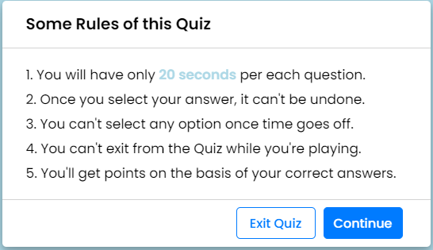
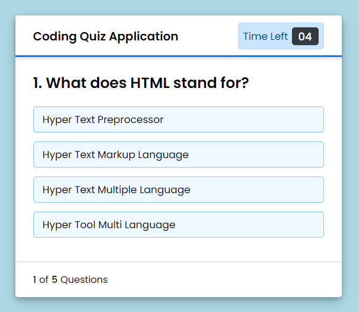
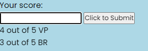

# Coding-Mutiple-Choice-Quiz
Multiple Choice Quiz Application

# Description:
A typical coding assessment is a combination of multiple-choice questions and interactive coding challenges.

# Installation instructuons:
Launch site in dafault browser

# Test Command:
To test type Click "Start Quiz" and answer questions. into the terminal

# Github:
https://github.com/victor5055/Coding-Mutiple-Choice-Quiz

# Deployment:
https://victor5055.github.io/Coding-Mutiple-Choice-Quiz/

# Contributors:
None at the time

# image

